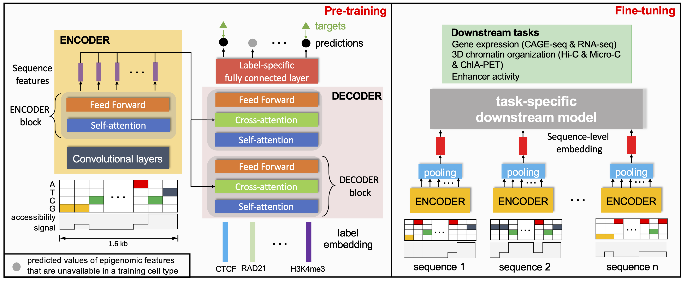

# EPCOT


EPCOT (jointly predicting <ins>EP</ins>igenome, <ins>C</ins>hromatin <ins>O</ins>rganization and <ins>T</ins>ranscription) is a comprehensive model to jointly predict epigenomic features, gene expression, high-resolution chromatin contact maps, and enhancer activities from DNA sequence and cell-type specific chromatin accessibility data. 


  
 ## Dependencies
* einops (0.3.2)
* kipoiseq (0.5.2)
* numpy (1.19.5)
* pytorch (1.10.1)
* scipy (1.7.3)
* scikit-learn (1.0.2)

You can use ```conda``` to install the required packages
```
conda create -n epcot python=3.9
conda activate epcot
pip install -r requirements.txt
```
  
  
